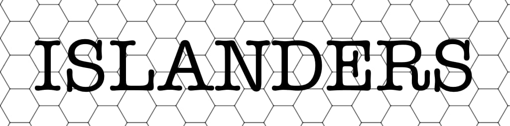
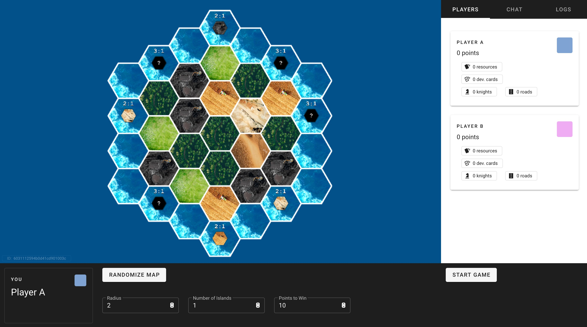
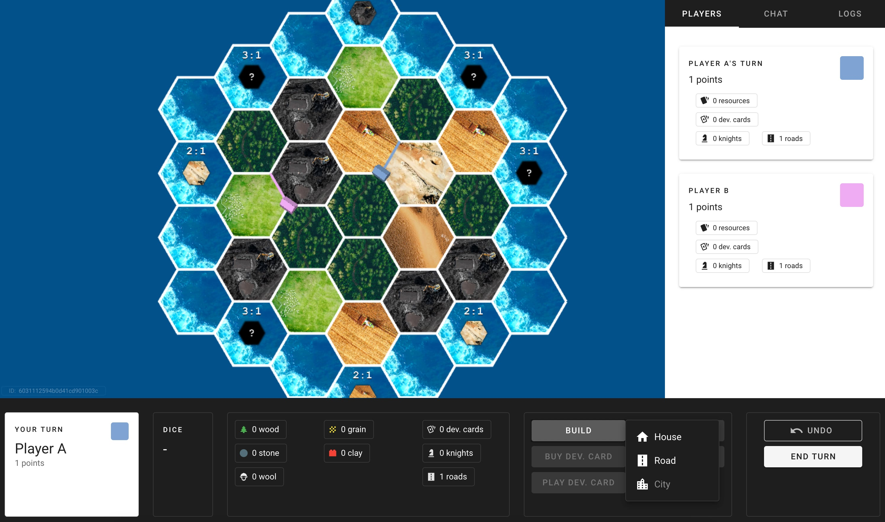

***

<b>Colonists</b> is an online real-time implementation of the magnificent <i>"The Settlers of Catan"</i> designed by Klaus Teuber.

***

# Play

Run the following on a system that has Docker installed:

    docker network create traefik_proxy
    docker build -t colonists/colonists-shared ./colonists-shared
    docker build -t colonists/colonists-client ./colonists-client
    docker build -t colonists/colonists-server ./colonists-server
    docker-compose up -d

If you have a running traefik service you can access the app at colonists.localhost.
Otherwise, run `docker inspect colonists-client | grep IPAddress` to find the ip address of the app.

## Implementation

The server, shared libraries and client are all written in TypeScript and transpiled to JavaScript. The server runs in node, and the client is built using Vue.

All modification on the game world are expressed in a monadic form, and will return a new game world when applied on the current world.
This gives us free "versioning" of the game world, gives us easy undo functionality and makes the real-time aspects of the game easier to work with and implement.

Feel free to take a look at the code and throw a PR if you are missing any features/rules (there's plenty of expansions to the game that we haven't implemented - yet)!
